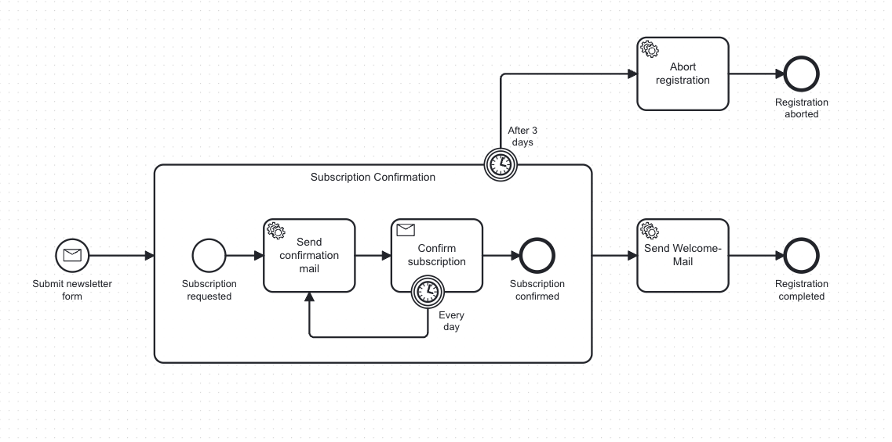

> 🚧 **This plugin is currently in a beta-version.
> Feel free to test it and provide feedback! :)**

# 🚀 bpmn-to-code

bpmn-to-code is a Maven and Gradle plugin designed to simplify process automation.
Its vision is to foster clean & robust solutions for BPMN-based process automation.
Therefore, it aims to provide a range of features —
such as generating API definition files from BPMN process models —
to reduce manual effort, simplify testing, promote the creation of clean process models,
and ensure consistency between your BPMN model and your code.

## **🤩** What it can do for you

**Streamlined Process Automation**

Say goodbye to the tedious task of manually referencing BPMN elements. bpmn-to-code automatically extracts key
details—like element IDs, messages, and worker types—and generates a lightweight “**Process API**” that keeps your
process models and code in sync.

**Java & Kotlin Code Generation**

Whether you’re developing in **Java** or **Kotlin**, our plugin creates ready-to-use API definitions that integrate
seamlessly with your testing frameworks, messaging systems, or any other automation logic.

**Engine Agnostic & Extensible**

Currently, bpmn-to-code supports both **Camunda** 7 and **Zeebe**. Built with extensibility in mind, it is designed so
that adding support for additional process engines is straightforward—if there is enough demand.

**Styleguide Validation** (🚧)

Looking ahead, I’m planing a styleguide validation feature. Much like a linter for code, it will analyze your BPMN
models against your custom style guide - ensuring that element IDs, message names, and task types adhere to predefined
patterns and naming conventions. This will help maintain designs that are as clean and consistent as your code.

## 📖 Story behind the plugin

If you want to learn more about the vision & story behind the plugin —
and the problems it aims to solve as well as the advantages it can bring —
check out the following posts:

- [🇬🇧 Simplifying process automation with bpmn-to-code](https://medium.com/miragon/simplifying-process-automation-with-bpmn-to-code-from-bpmn-models-to-process-apis-216adafeb0ac)
- [🇩🇪 Mit bpmn-to-code ein deine Prozesse & Code in Einklang bringen](https://www.miragon.io/blog/mit-bpmn-to-code-deine-prozesse-and-code-in-einklang-bringen/)

## 💡 Process-API generation in action

The key feature of bpmn-to-code is generating a lightweight “Process API” for your BPMN models.
Let’s say you have a newsletter subscription workflow (BPMN) that looks like this:



After running bpmn-to-code, you’ll have a Kotlin (or Java) file that programmatically references your process model. For
example:

```kotlin
// Generated by bpmn-to-code
@file:Suppress("unused")

package de.emaarco.example

import kotlin.String
import kotlin.Suppress

object NewsletterSubscriptionProcessApiV1 {
    val PROCESS_ID: String = "newsletterSubscription"

    object Elements {
        val Timer_EveryDay: String = "Timer_EveryDay"
        val Timer_After3Days: String = "Timer_After3Days"
        val ErrorEvent_InvalidMail: String = "ErrorEvent_InvalidMail"
        val Activity_ConfirmRegistration: String = "Activity_ConfirmRegistration"
        val SubProcess_Confirmation: String = "SubProcess_Confirmation"
        val EndEvent_RegistrationAborted: String = "EndEvent_RegistrationAborted"
        val EndEvent_SubscriptionConfirmed: String = "EndEvent_SubscriptionConfirmed"
        val EndEvent_RegistrationCompleted: String = "EndEvent_RegistrationCompleted"
        val EndEvent_RegistrationNotPossible: String = "EndEvent_RegistrationNotPossible"
        val Activity_AbortRegistration: String = "Activity_AbortRegistration"
        val Activity_SendWelcomeMail: String = "Activity_SendWelcomeMail"
        val Activity_SendConfirmationMail: String = "Activity_SendConfirmationMail"
        val StartEvent_SubmitRegistrationForm: String = "StartEvent_SubmitRegistrationForm"
        val StartEvent_RequestReceived: String = "StartEvent_RequestReceived"
    }

    object Messages {
        val Message_FormSubmitted: String = "Message_FormSubmitted"
        val Message_SubscriptionConfirmed: String = "Message_SubscriptionConfirmed"
    }

    object TaskTypes {
        val EndEvent_RegistrationCompleted: String = "newsletter.registrationCompleted"
        val Activity_AbortRegistration: String = "newsletter.abortRegistration"
        val Activity_SendWelcomeMail: String = "newsletter.sendWelcomeMail"
        val Activity_SendConfirmationMail: String = "newsletter.sendConfirmationMail"
    }

    object Timers {
        val Timer_EveryDay: BpmnTimer = BpmnTimer("Duration", "PT1M")
        val Timer_After3Days: BpmnTimer = BpmnTimer("Duration", "PT2M30S")

        data class BpmnTimer(
            val type: String,
            val timerValue: String,
        )
    }

    object Errors {
        val Error_InvalidMail: BpmnError = BpmnError("Error_InvalidMail", "500")

        data class BpmnError(
            val name: String,
            val code: String,
        )
    }

    object Signals {
        val Signal_RegistrationNotPossible: String = "Signal_RegistrationNotPossible"
    }
}
```

All you need is a simple Gradle task configuration that specifies **where** your BPMN models reside,
**where** to output the generated API files, **which** language (Java or Kotlin) to generate,
and **which** process engine your models target (e.g., Camunda 7 or Zeebe):

```kotlin
tasks.named("generateBpmnModelApi", GenerateBpmnModelsTask::class) {
    baseDir = projectDir.toString()
    filePattern = "src/main/resources/**/*.bpmn"
    outputFolderPath = "$projectDir/src/main/kotlin"
    packagePath = "de.emaarco.example"
    outputLanguage = OutputLanguage.KOTLIN
    processEngine = ProcessEngine.ZEEBE
    useVersioning = false
}
```

Once configured, **bpmn-to-code** automatically picks up your BPMN files and generates convenient,
type-safe references you can use throughout your application—be it for testing, messaging,
or worker definitions.

## 📦 Structure

bpmn-to-code is available for both Gradle and Maven.
For detailed installation and configuration instructions,
please refer to the respective module README's:

- [bpmn-to-code-gradle](bpmn-to-code-gradle/README.md): Gradle plugin integration for
  projects using Gradle.
- [bpmn-to-code-maven](bpmn-to-code-maven/README.md): Maven plugin integration for
  projects using Maven.
- [bpmn-to-code-core](bpmn-to-code-core): Contains the core logic for parsing BPMN files and generating the API
  representation.
- [examples](examples): Contains gradle- & maven-example projects demonstrating how to use the plugin. They are not part
  of the
  gradle-monorepo. In case you clone the repository, I'd suggest you to open them as a separate project.

## 📬 Get the Plugin

You can find the plugin on either
the [Maven Central Repository](https://central.sonatype.com/artifact/io.github.emaarco/bpmn-to-code-maven)
or the [Gradle Plugin Portal](https://plugins.gradle.org/plugin/io.github.emaarco.bpmn-to-code-gradle)

## 🤝 Contributing

Community contributions are at the heart of bpmn-to-code’s vision.
If you have ideas to improve the code generation, want to add support for a new engine,
or are keen to help shape the styleguide validator,
please join me on [GitHub](https://github.com/example/bpmn-to-code).
Submit issues, open pull requests, or simply start a discussion.
