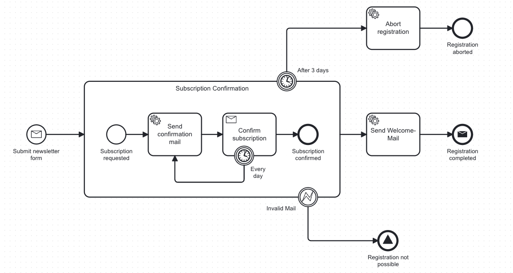

> **bpmn-to-code is now publicly available!**
> While the project is still in its early phase, all core features are ready to use.
> Your feedback and contributions are highly appreciated as we continue to improve and expand the toolset.

# 🚀 bpmn-to-code

**[Documentation](https://emaarco.github.io/bpmn-to-code/)** | **[Web App](https://bpmn-to-code.miragon.io/static/index.html)**

bpmn-to-code is a tool designed to simplify process automation through automated code generation from BPMN models.
Its vision is to foster clean & robust solutions for BPMN-based process automation.
Therefore, it aims to provide a range of features —
such as generating API definition files from BPMN process models —
to reduce manual effort, simplify testing, promote the creation of clean process models,
and ensure consistency between your BPMN model and your code.

## **🤩** What it can do for you

**Streamlined Process Automation**

Say goodbye to the tedious task of manually referencing BPMN elements. bpmn-to-code automatically extracts key
details—like element IDs, messages, and worker types—and generates a lightweight “**Process API**” that keeps your
process models and code in sync.

**Java & Kotlin Code Generation**

Whether you’re developing in **Java** or **Kotlin**, our plugin creates ready-to-use API definitions that integrate
seamlessly with your testing frameworks, messaging systems, or any other automation logic.

**Engine Agnostic & Extensible**

Currently, bpmn-to-code supports **Camunda 7**, **Zeebe**, and **Operaton**. Built with extensibility in mind, it is designed so
that adding support for additional process engines is straightforward—if there is enough demand.

**Styleguide Validation** (🚧)

Looking ahead, I’m planing a styleguide validation feature. Much like a linter for code, it will analyze your BPMN
models against your custom style guide - ensuring that element IDs, message names, and task types adhere to predefined
patterns and naming conventions. This will help maintain designs that are as clean and consistent as your code.

## 📖 Story behind the plugin

If you want to learn more about the vision & story behind the plugin —
and the problems it aims to solve as well as the advantages it can bring —
check out the following posts:

- [🇬🇧 Simplifying process automation with bpmn-to-code](https://medium.com/miragon/simplifying-process-automation-with-bpmn-to-code-from-bpmn-models-to-process-apis-216adafeb0ac)
- [🇩🇪 Mit bpmn-to-code ein deine Prozesse & Code in Einklang bringen](https://www.miragon.io/blog/mit-bpmn-to-code-deine-prozesse-and-code-in-einklang-bringen/)

## 💡 Process-API generation in action

The key feature of bpmn-to-code is generating a lightweight “Process API” for your BPMN models.
Let’s say you have a newsletter subscription workflow (BPMN) that looks like this:



After running bpmn-to-code, you’ll have a Kotlin (or Java) file that programmatically references your process model. For
example:

```kotlin
// Generated by bpmn-to-code
@file:Suppress("unused")

package de.emaarco.example

import kotlin.String
import kotlin.Suppress

object NewsletterSubscriptionProcessApiV1 {
    const val PROCESS_ID: String = "newsletterSubscription"

    object Elements {
        const val TIMER_EVERY_DAY: String = "Timer_EveryDay"
        const val TIMER_AFTER_3_DAYS: String = "Timer_After3Days"
        const val ERROR_EVENT_INVALID_MAIL: String = "ErrorEvent_InvalidMail"
        const val ACTIVITY_CONFIRM_REGISTRATION: String = "Activity_ConfirmRegistration"
        const val SUB_PROCESS_CONFIRMATION: String = "SubProcess_Confirmation"
        const val END_EVENT_REGISTRATION_ABORTED: String = "EndEvent_RegistrationAborted"
        const val END_EVENT_SUBSCRIPTION_CONFIRMED: String = "EndEvent_SubscriptionConfirmed"
        const val END_EVENT_REGISTRATION_COMPLETED: String = "EndEvent_RegistrationCompleted"
        const val END_EVENT_REGISTRATION_NOT_POSSIBLE: String = "EndEvent_RegistrationNotPossible"
        const val ACTIVITY_ABORT_REGISTRATION: String = "Activity_AbortRegistration"
        const val ACTIVITY_SEND_WELCOME_MAIL: String = "Activity_SendWelcomeMail"
        const val ACTIVITY_SEND_CONFIRMATION_MAIL: String = "Activity_SendConfirmationMail"
        const val START_EVENT_SUBMIT_REGISTRATION_FORM: String = "StartEvent_SubmitRegistrationForm"
        const val START_EVENT_REQUEST_RECEIVED: String = "StartEvent_RequestReceived"
    }

    object Messages {
        const val MESSAGE_FORM_SUBMITTED: String = "Message_FormSubmitted"
        const val MESSAGE_SUBSCRIPTION_CONFIRMED: String = "Message_SubscriptionConfirmed"
    }

    object TaskTypes {
        const val NEWSLETTER_REGISTRATION_COMPLETED: String = "newsletter.registrationCompleted"
        const val NEWSLETTER_ABORT_REGISTRATION: String = "newsletter.abortRegistration"
        const val NEWSLETTER_SEND_WELCOME_MAIL: String = "newsletter.sendWelcomeMail"
        const val NEWSLETTER_SEND_CONFIRMATION_MAIL: String = "newsletter.sendConfirmationMail"
    }

    object Timers {
        val TIMER_EVERY_DAY: BpmnTimer = BpmnTimer("Duration", "PT1M")
        val TIMER_AFTER_3_DAYS: BpmnTimer = BpmnTimer("Duration", "PT2M30S")

        data class BpmnTimer(
            val type: String,
            val timerValue: String,
        )
    }

    object Errors {
        val ERROR_INVALID_MAIL: BpmnError = BpmnError("Error_InvalidMail", "500")

        data class BpmnError(
            val name: String,
            val code: String,
        )
    }

    object Signals {
        const val SIGNAL_REGISTRATION_NOT_POSSIBLE: String = "Signal_RegistrationNotPossible"
    }

    object Variables {
        const val SUBSCRIPTION_ID: String = "subscriptionId"
    }
}
```

All you need is a simple Gradle task configuration that specifies **where** your BPMN models reside,
**where** to output the generated API files, **which** language (Java or Kotlin) to generate,
and **which** process engine your models target (e.g., Camunda 7 or Zeebe):

```kotlin
tasks.named("generateBpmnModelApi", GenerateBpmnModelsTask::class) {
    baseDir = projectDir.toString()
    filePattern = "src/main/resources/**/*.bpmn"
    outputFolderPath = "$projectDir/src/main/kotlin"
    packagePath = "de.emaarco.example"
    outputLanguage = OutputLanguage.KOTLIN
    processEngine = ProcessEngine.ZEEBE
    useVersioning = false
}
```

Once configured, **bpmn-to-code** automatically picks up your BPMN files and generates convenient,
type-safe references you can use throughout your application—be it for testing, messaging,
or worker definitions.

## 📋 Best Practices

For guidance on how to model BPMN processes that work optimally with bpmn-to-code, check out our [Best Practices for Process Modeling](docs/best-practices-process-modeling.md) guide. It covers naming conventions, variable management, versioning strategies, and multi-environment modeling.

## 📦 Structure

bpmn-to-code consists of multiple modules to support different use cases:

### User-Facing Modules
- [bpmn-to-code-gradle](bpmn-to-code-gradle/README.md): Gradle plugin for integrating code generation
  into Gradle builds.
- [bpmn-to-code-maven](bpmn-to-code-maven/README.md): Maven plugin for integrating code generation
  into Maven builds.
- [bpmn-to-code-web](bpmn-to-code-web/README.md): Web application for browser-based code generation (preview available).
- [bpmn-to-code-mcp](bpmn-to-code-mcp/README.md): MCP server for AI-assisted code generation (experimental).

### Core
- [bpmn-to-code-core](bpmn-to-code-core): Core logic for parsing BPMN files and generating API code.
  Shared by all user-facing modules.

### Examples

Projects using bpmn-to-code in practice:
- [easy-zeebe](https://github.com/emaarco/easy-zeebe): Zeebe-based process automation example
- [engine-safari](https://github.com/emaarco/engine-safari): Multi-engine comparison project

## 📬 Get bpmn-to-code

**Web Application (Preview):**
- 🌐 [Live Preview](https://bpmn-to-code.miragon.io/static/index.html) - Browser-based, no installation required
- 🐳 [Docker Hub](https://hub.docker.com/r/emaarco/bpmn-to-code-web) - Self-hostable container

**Build Plugins:**
- 📦 [Maven Central Repository](https://central.sonatype.com/artifact/io.github.emaarco/bpmn-to-code-maven) - Maven Plugin
- 📦 [Gradle Plugin Portal](https://plugins.gradle.org/plugin/io.github.emaarco.bpmn-to-code-gradle) - Gradle Plugin

**MCP Server (Experimental):**
- 🤖 [Setup Instructions](bpmn-to-code-mcp/README.md) - Use bpmn-to-code directly from AI assistants via MCP

## 🤖 AI Agent Skills

bpmn-to-code includes [AI coding assistant skills](docs/skills.md) that help you set up and work with the project.

**Install skills in [Claude Code](https://docs.anthropic.com/en/docs/claude-code):**

```bash
# Install all skills at once
npx skills add https://github.com/emaarco/bpmn-to-code

# Or pick only what you need
npx skills add https://github.com/emaarco/bpmn-to-code/tree/main/.claude/skills/setup-bpmn-to-code-gradle
npx skills add https://github.com/emaarco/bpmn-to-code/tree/main/.claude/skills/setup-bpmn-to-code-maven
npx skills add https://github.com/emaarco/bpmn-to-code/tree/main/.claude/skills/migrate-to-bpmn-to-code-apis
```

Available skills include project setup (Gradle & Maven), API migration, issue management, ADR writing, and code review.
See the [full skills index](docs/skills.md) for details.

## 🤝 Contributing

Community contributions are at the heart of bpmn-to-code’s vision.
If you have ideas to improve the code generation, want to add support for a new engine,
or are keen to help shape the styleguide validator,
please join me on [GitHub](https://github.com/example/bpmn-to-code).
Submit issues, open pull requests, or simply start a discussion.
