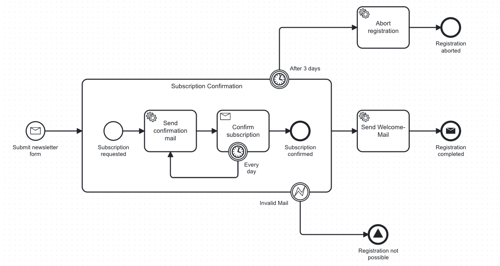

> 🚧 **This plugin is currently in a beta-version.
> Feel free to test it and provide feedback! :)**

# 🚀 bpmn-to-code

bpmn-to-code is a **Maven** and **Gradle** plugin designed to simplify process automation.
Its vision is to foster clean & robust solutions for BPMN-based process automation.
Therefore, it aims to provide a range of features -
such as the generation of API definition files from BPMN process models -
to reduce manual effort, promote the creation of clean process models
and ensure consistency between your BPMN model and your code.

## 🎯 Purpose

In typical BPMN automation projects, developers often need to manually reference message names,
element names, or service task types from the BPMN model.
This can lead to errors, duplication of effort, and maintenance challenges.
BPMN to Code automates this process by:

- Extracting **element names** for testing and other programmatic use cases.
- Exporting **message names** for easy interaction with the process API.
- Providing information about **service task types** for integration purposes.

With BPMN to Code, you can streamline your workflow, improve accuracy,
and focus on building robust process automation solutions.

## ✨ Features

- **Java and Kotlin Support:** Generate API-definition files in Java or Kotlin, based on your preference.
- **Automated Extraction:** Automatically extract relevant data (message names, element names, service task types) from
  BPMN process models.
- **Flexible Use Cases:** Use the generated APIs for process testing, message handling, and other automation scenarios.
- **Supports multiple engines:** The plugin currently supports Camunda 7 and Zeebe, but is designed to be as extensible
  as possible to also support other process engines.

## 💡 The plugin in action

Assuming you have a bpmn-process to manage newsletter subscriptions, that looks like this:



Then, based on the technical configuration, the generated API file for Kotlin could look like this:

```kotlin
package com.example.process

package com.example.process

public object NewsletterSubscriptionProcessApi {
    public val PROCESS_ID: String = "newsletterSubscription"

    public object Elements {
        public val StartEvent_RequestReceived: String = "StartEvent_RequestReceived"
        public val Activity_SendConfirmationMail: String = "Activity_SendConfirmationMail"
        public val Activity_ConfirmRegistration: String = "Activity_ConfirmRegistration"
        public val Activity_SendWelcomeMail: String = "Activity_SendWelcomeMail"
        public val EndEvent_RegistrationCompleted: String = "EndEvent_RegistrationCompleted"
    }

    public object Messages {
        public val Message_FormSubmitted: String = "Message_FormSubmitted"
        public val Message_SubscriptionConfirmed: String = "Message_SubscriptionConfirmed"
    }

    public object TaskTypes {
        public val Activity_SendConfirmationMail: String = "newsletter.sendConfirmationMail"
        public val Activity_SendWelcomeMail: String = "newsletter.sendWelcomeMail"
    }
}
```

## 📦 Modules

bpmn-to-code is available for both Gradle and Maven.
For detailed installation and configuration instructions,
please refer to the respective module README's:

- **bpmn-to-code-core**: Contains the core logic for parsing BPMN files and generating the API representation.
- [bpmn-to-code-gradle](bpmn-to-code-gradle/README.md): Gradle plugin integration for projects using Gradle.
- [bpmn-to-code-maven](bpmn-to-code-maven/README.md): Maven plugin integration for projects using Maven.

## 🤝 Contributing

Contributions are welcome! Feel free to open issues or submit pull requests on
the [GitHub repository](https://github.com/example/bpmn-to-code).

## 📜 License

This project is licensed under the MIT License. See the `LICENSE` file for details.
